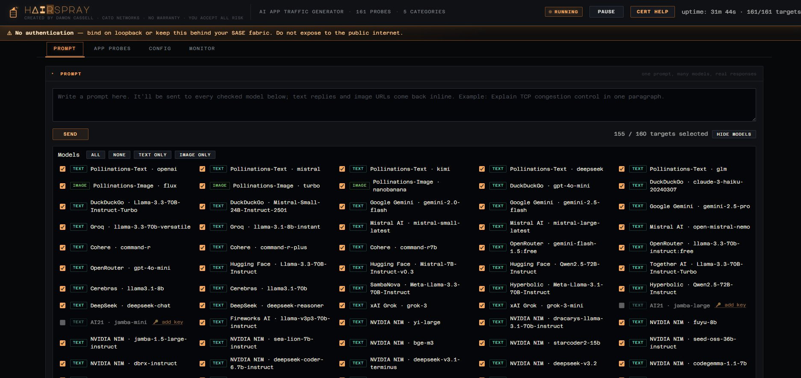

# hAIrspray

**Generate traffic at public AI applications from a single box so your
SASE / NGFW / SWG shows you whether it can actually identify, classify,
and control them.**



<sub>Prompt & Fire — one prompt, 160 model/provider pairs, real responses streamed back inline. 12 keyless providers (Pollinations, DuckDuckGo AI Chat), 16 keyed free-tier providers (Gemini, Groq, Mistral, Cohere, OpenRouter, HuggingFace, Together, Cerebras, SambaNova, Hyperbolic, DeepSeek, xAI, AI21, Fireworks, NVIDIA NIM, GitHub Models). Live dynamic-discovery populates the grid with whatever models each key actually unlocks.</sub>

Vendors claim AI-app visibility. hAIrspray lets you find out. Point it
at your corporate egress, enable the probes relevant to your test, and
watch your security fabric's application-analytics dashboard light up —
or fail to.

> _Created by Damon Cassell · Cato Networks · No Warranty · You Accept
> All Risk._

---

## What this is for

Modern SASE platforms and next-generation firewalls market AI-app
inspection as a first-class feature: policy rules that target
"OpenAI ChatGPT" or "Generative AI" as a category, DLP over GenAI
prompt bodies, block lists for specific model providers, and so on.

The only way to know whether a given vendor's app-ID actually sees
what it claims to see is to generate realistic traffic at the real
services and look at what the fabric reports. hAIrspray is that
traffic generator. It runs as a container behind your SASE fabric (or
through your NGFW egress) and fires outbound requests at **181 curated
AI endpoints** so you can:

- Verify your vendor's app signatures fire for each AI service you
  care about (not just OpenAI).
- Measure classification latency — how fast does the first hit become
  a matched app event?
- Test policy rules: block categories, rate-limit models, inspect
  prompt bodies with DLP, force TLS inspection on AI gateways.
- Compare vendors side-by-side on the same probe catalog.
- Produce reproducible sample traffic for customer demos or MSP lab
  setups.

## What actually goes out the wire

- **181 probes across 7 categories**: LLM APIs (OpenAI, Anthropic,
  Gemini, Groq, Mistral, Cohere, and ~16 more), chatbot UIs (ChatGPT,
  Claude.ai, Gemini Web, Copilot, Character.AI, and ~27 more), media
  generation (Midjourney, Leonardo, Runway, Suno, ElevenLabs, and ~44
  more), aggregators (HuggingFace, Replicate, OpenRouter, Cursor,
  Lovable, and ~50 more), MCP synthetic traffic (JSON-RPC payloads
  to reflectors and known public MCP server hostnames — both legacy
  HTTP+SSE and current Streamable HTTP transports), authed MCP traffic
  (real handshakes against GitHub MCP, Notion MCP, and Linear MCP
  when you've saved a token in Config → Keys), and a small "real
  response" set.
- **Realistic request shapes.** LLM-API probes use SDK-style
  User-Agents (`OpenAI/Python 1.51.0`, `anthropic-python/0.39.0`) and
  the right endpoints, bodies, and auth headers. Chatbot-UI probes
  use browser User-Agents and the URLs a browser would fetch. No key
  required — 401/403 is fine, the flow is the point.
- **Real AI responses** for the "Prompt & Fire" flow. Twelve keyless
  model/provider pairs (Pollinations text + image, DuckDuckGo AI Chat)
  return real completions. Sixteen additional providers unlock real
  responses if you paste free-tier API keys (Gemini, Groq, Mistral,
  Cohere, OpenRouter, HuggingFace, Together, Cerebras, SambaNova,
  Hyperbolic, DeepSeek, xAI, AI21, Fireworks, NVIDIA NIM, GitHub
  Models).
- **Configurable pacing**: 30–180s random gaps between probes by
  default, plus optional burst mode (3–7 back-to-back requests at
  1–4s intervals) for session-like patterns.
- **TLS / HTTP/2** on every endpoint that supports it (`httpx[http2]`).

## Quick start

On a Linux Docker host sitting behind the SASE fabric or NGFW you want
to test:

```bash
cd /opt
sudo git clone https://github.com/dzcassell/hAIrspray.git
sudo chown -R "$USER": hAIrspray
cd hAIrspray

cp .env.example .env
# Edit .env if you want to narrow categories, tune pacing, or bind
# the UI to loopback only.

docker compose up -d --build
docker compose logs -f
```

Then open `http://<host>:8090/` — the web UI is the primary interface.
You can also run it as a systemd service with the unit file in
`systemd/hairspray.service`.

## Running on macOS

hAIrspray runs on current macOS (Apple Silicon, Docker Desktop)
without any code changes. The container itself is Linux, executing
inside Docker Desktop's lightweight VM — macOS is only hosting the
process and forwarding port 8090 to your browser.

### Quick start on macOS

```bash
# Install Docker Desktop if you haven't already:
#   https://www.docker.com/products/docker-desktop/
# Open the app so the whale icon appears in your menu bar. Docker
# Desktop must be running before any `docker compose` command works.

git clone https://github.com/dzcassell/hAIrspray.git ~/Code/hAIrspray
cd ~/Code/hAIrspray

cp .env.example .env
# Optional edits: narrow categories, bind the UI to loopback
# (HEALTH_BIND=127.0.0.1), change the host port, etc.

docker compose up -d --build
docker compose logs -f
```

Open <http://localhost:8090> in Safari or your browser of choice.

### Autostart options

On Linux, autostart is handled by `systemd/hairspray.service`. macOS
has no systemd; you have two options:

**Option 1 (simplest) — Docker Desktop's built-in autostart.** Open
Docker Desktop → Settings → General → check "Start Docker Desktop
when you log in." Because `docker-compose.yml` declares
`restart: unless-stopped`, the hAIrspray container resumes
automatically whenever Docker Desktop starts. For most lab use, this
is all you need.

**Option 2 — launchd agent.** If you want hAIrspray to come up
deterministically on every login, independent of Docker Desktop's
own autostart setting, install the launchd agent shipped in
`macos/`:

```bash
cd ~/Code/hAIrspray
./macos/install.sh
```

What the installer does:

1. Renders `macos/hairspray.plist.template` with your absolute
   paths (launchd doesn't expand `~` or `$HOME` in plist values)
   and writes the result to
   `~/Library/LaunchAgents/ai.hairspray.autostart.plist`.
2. Makes `macos/hairspray-start.sh` executable — this is the
   wrapper launchd actually invokes. It polls `docker info` for up
   to 3 minutes, waiting for Docker Desktop to finish initializing
   its Linux VM (on a cold boot this can take 30–90s), then runs
   `docker compose up -d --build`.
3. Loads the agent with `launchctl load`, so it runs immediately
   and on every login thereafter.

Logs go to `~/Library/Logs/hAIrspray-launchd.log`. To check status:

```bash
launchctl list | grep ai.hairspray.autostart
```

To remove the agent later:

```bash
launchctl unload ~/Library/LaunchAgents/ai.hairspray.autostart.plist
rm ~/Library/LaunchAgents/ai.hairspray.autostart.plist
```

The launchd agent runs **per-user** (it's in `~/Library/` not
`/Library/`), so it won't try to start hAIrspray before the user
logs in. Docker Desktop is also per-user, so this matches the
expected lifecycle.

### Things that are different on macOS

- **No systemd.** The `systemd/hairspray.service` file is Linux-only;
  ignore it on Mac.
- **Paths.** The Linux quick-start uses `/opt`; on Mac, `~/Code/hAIrspray`
  is more idiomatic, and you don't need `sudo` to clone into your
  home directory.
- **Named volumes, not bind mounts.** hAIrspray only uses named Docker
  volumes, so you don't hit Docker Desktop's bind-mount file-sharing
  performance quirks. Saved API keys live in the `ai-spray-keys`
  volume inside Docker Desktop's VM and persist across container
  rebuilds.
- **Resource limits.** Docker Desktop caps CPU/RAM from the Mac's
  pool; the defaults (~4 CPUs, 8 GB RAM) are more than enough for
  hAIrspray, which uses well under 200 MB at full tilt.
- **No `tini` install needed.** The container already bundles tini;
  macOS doesn't care what runs as PID 1 inside the Linux VM.

## The UI

Five tabs:

- **Prompt & Fire** — send a real prompt to every keyless (and keyed,
  if you saved keys) AI provider at once. Responses stream back
  inline. This is the fastest way to show a SASE demo audience that
  AI DLP either is or isn't inspecting the reply body.
- **App Probes** — the full 181-entry probe catalog. Filter by name,
  URL, or category; enable/disable individual probes; fire a single
  probe, fire an entire category, or fire every enabled probe once
  (concurrency-capped) via **⚡ Fire All**.
- **Profile Tests** — synthetic-PII DLP testing. Pick a model + locale
  + payload shape, tick categories of PII to test (Address, Phone,
  SSN, IBAN, Credit Card, Passport, MRN, etc. — 17 categories), fire
  individually or in bulk, and see which payloads were blocked,
  partially redacted, or echoed verbatim. The **Payload** dropdown
  switches between standard chat-completion bodies and MCP
  `tools/call` envelopes — the latter tests whether your DLP engine
  actually parses MCP payloads or treats them as opaque JSON.
- **Config** — scheduler knobs (min/max interval, burst probability,
  burst size, burst gap, category toggles) and the persistent key
  store. Sixteen keyed AI providers (Groq, Mistral, Gemini, Cohere,
  OpenRouter, HuggingFace, Together, Cerebras, SambaNova, Hyperbolic,
  DeepSeek, xAI, AI21, Fireworks, NVIDIA NIM, GitHub Models) plus
  three keyed MCP servers (GitHub MCP, Notion MCP, Linear MCP).
  **Dynamic model discovery**: when you save an AI key, hAIrspray
  calls the provider's `/v1/models` endpoint with it and caches
  whatever catalog that key unlocks, so the Prompt grid always
  renders models your key actually has access to. A **↻** button per
  row re-runs discovery when a vendor churns their catalog.
- **Monitor** — live stats (totals, per-category bars, OK vs error
  counts) and an SSE-streamed event log with search, category
  filter, status filter, and NDJSON export.

## A note on obtaining free API keys

The easiest way to stand up accounts across the sixteen keyed
providers is with a Gmail address. Most of them accept **"Sign in
with Google"** for signup, so a single Google account gets you keys
across most of the catalog in roughly a minute each — no need to
create a dozen-plus separate accounts, verify email on each, set a
new password each, and so on.

Providers that accept Google OAuth for signup (at time of writing):

- Google Gemini (obviously — it's theirs)
- Groq, Mistral, Cohere
- OpenRouter, Together, Fireworks, Cerebras
- HuggingFace, Hyperbolic, SambaNova, AI21
- NVIDIA NIM (via the NVIDIA Developer Program, which itself
  accepts Google)

The two-and-a-half exceptions worth knowing about:

- **GitHub Models** uses your GitHub account — fair enough, since
  the whole point of the service is that you're already on GitHub.
  Generate a personal access token with the `models:read` scope
  and paste that instead.
- **DeepSeek** typically requires email (and sometimes phone)
  signup rather than Google OAuth. It's a Chinese cloud provider;
  the console is mostly English-localized but the signup flow is
  more conventional.
- **xAI** is the half — Google OAuth is sometimes available,
  sometimes not, depending on the current state of their auth
  integrations. X/Twitter auth is the reliably-present alternative.

The Config → Keys panel in hAIrspray puts a **🔑 add key** link next
to every provider that jumps you directly to that vendor's key-
generation page, so you don't need to hunt through each vendor's
documentation to find where they hid it. Expected total time to
populate the whole panel from scratch on a fresh Gmail account:
roughly 20–30 minutes, most of which is clicking through sign-up
flows rather than anything hAIrspray-specific.

## Typical SASE/NGFW test workflow

1. **Deploy behind the fabric** you want to test. For SASE sockets,
   that's usually a LAN host whose default route is the socket. For
   NGFWs, any host on the inside interface.
2. **Disable everything** in the App Probes tab, then enable only the
   category you're testing (e.g. `llm_api` if you're validating LLM
   API signatures).
3. **Click ⚡ Fire All.** hAIrspray will hit every enabled probe
   once with bounded concurrency (default 10).
4. **Open your vendor's app-analytics dashboard.** For Cato, that's
   _Monitoring → Events → Application Analytics_ filtered by the
   source IP of your hAIrspray host. You should see one matched
   event per probe.
5. **Compare against the probe list.** Any miss is a gap in your
   vendor's signatures or your license/policy tier.
6. **Optional**: save a free-tier API key for Groq or Google Gemini
   in Config, then use Prompt & Fire to submit a prompt. The
   response body is what DLP will see — good for testing GenAI DLP
   rules.

## Architecture

Python 3.12, asyncio, `httpx[http2]` for egress, Starlette + uvicorn
for the web UI/API, structlog for JSON logs. Single-process, single-
container. State lives in memory except for saved API keys, which are
persisted to a Docker-managed named volume at `/data/keys.json`
(mode 0600, schema-versioned JSON). See `app/keys.py`.

Event flow: the scheduler picks a probe, runs it through an
`httpx.AsyncClient`, and publishes a `ProviderResult` into shared
state. The state publishes to an internal ring buffer plus any
connected SSE subscribers, driving the Live Log and stats in the UI.
Fire All and Prompt & Fire use the same publish path, so every
request — scheduled or manual — appears in the same Monitor stream
and in your SASE's logs at the same layer.

## Security caveats

- **No authentication on the web UI.** Bind it to loopback
  (`HEALTH_BIND=127.0.0.1` in `.env`) or keep the host behind your
  SASE fabric. _Do not expose to the public internet._
- **API keys are stored in plaintext** inside a Docker volume. File
  mode is 0600 but anyone with Docker socket access on the host
  (i.e. membership in the `docker` group) can read them. This is a
  lab tool; do not store keys here that would cost real money if
  leaked.
- **This tool generates actual requests at real services.** If you
  leave it running indefinitely at high concurrency it is fully
  capable of tripping rate limiters and getting your source IP
  temporarily banned by some providers. Default pacing is
  deliberately slow.
- **TLS verification: three modes in priority order.** Most SASE
  deployments need the first one.
  1. **Custom CA bundle (preferred).** Drop your SASE/NGFW re-sign
     root CA into `./certs/` as a `.crt`, `.pem`, or `.cer` file
     (see [`certs/README.md`](certs/README.md)). At container boot,
     it's concatenated with certifi's Mozilla store and httpx is
     pointed at the combined bundle. You get **full TLS verification
     on every flow** — including flows re-signed by your fabric, but
     also catching anything the fabric didn't sign. This is how
     enterprise-grade tools are meant to live inside an inspecting
     fabric.
  2. **Stock verification.** If no extras are in `./certs/` and
     `TLS_VERIFY=true`, the container verifies against the built-in
     Mozilla bundle. Correct mode when not behind any inspecting
     fabric.
  3. **Verification bypassed.** If no extras are in `./certs/` and
     `TLS_VERIFY=false` (default), TLS verification is disabled
     entirely. Compatibility mode; the container cannot detect MitM
     on its own in this mode, so only use it where you fully trust
     the network path.

  The boot log always states which mode won. Grep for `tls_custom_ca`,
  `tls_system_verify`, or `tls_verify_disabled` in
  `docker compose logs hairspray`.

## Documentation

Code map:

- `app/registry.py` — the 181-probe catalog
- `app/prompt.py` — the 12 keyless + 16 keyed prompt-capable providers
- `app/discovery.py` — per-provider `/v1/models` fetchers that power
  dynamic model discovery (three request shapes: openai-compatible,
  gemini, cohere)
- `app/keys.py` — persistent key store (Docker volume, mode-0600
  JSON, v2 schema with per-provider model cache)
- `app/config.py` — all `.env` knobs and their defaults
- `app/web.py` — REST + SSE API surface (`/healthz`, `/metrics`,
  `/api/status`, `/api/config`, `/api/targets/…`, `/api/fire-all`,
  `/api/scheduler/…`, `/api/events/stream`, `/api/prompt/…`,
  `/api/keys/…`)
- `app/main.py` — entry point; the `_resolve_tls_verify()` function
  at the top picks TLS mode at boot (custom bundle / system / bypass)

Deployment:

- `.env.example` — every tunable with inline notes
- `Dockerfile` — multi-stage build against `python:3.12-slim`
  (multi-arch: works on linux/amd64 and linux/arm64)
- `docker-compose.yml` — named `ai-spray-keys` volume for key
  persistence; bind-mount of `./certs/` into
  `/etc/ssl/hairspray-extra-ca:ro` for SASE CA trust
- `certs/README.md` — how to install your SASE/NGFW re-sign CA so
  TLS verification works inside an inspecting fabric (also
  accessible in-app via the **CERT HELP** button in the header)
- `systemd/hairspray.service` — systemd unit for Linux autostart
- `macos/` — launchd agent + installer for macOS autostart
  independent of Docker Desktop's own start-at-login setting

## License

MIT — see [`LICENSE`](LICENSE). You accept all risk of using this
tool. Nothing about it is warrantied.
